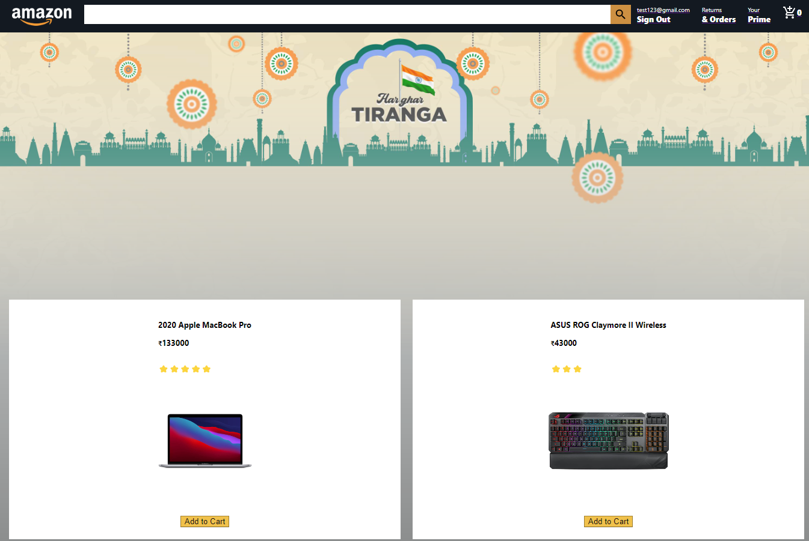

<<<<<<< HEAD
# AMAZON CLONE
=======

  

<h1 align="center">AMAZON CLONE</h1>

<h3 align="center">TECHNOLOGY USED</h3>

React.js,Firebase,HTML,CSS

In the project directory, you can run:

### `npm start`

